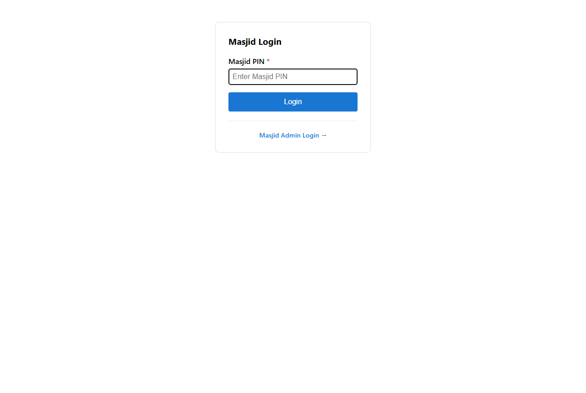
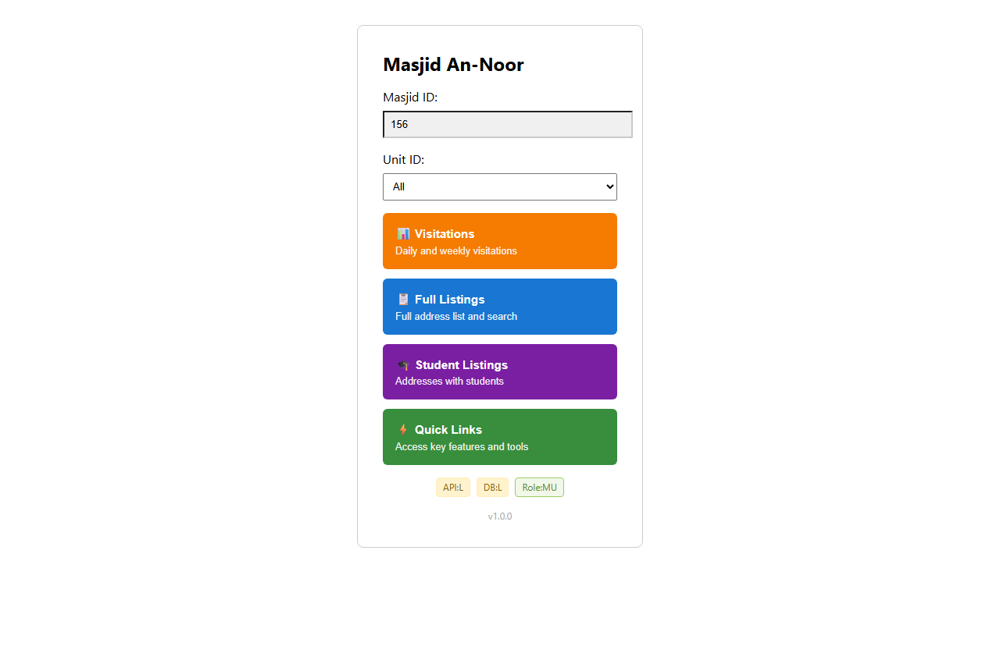
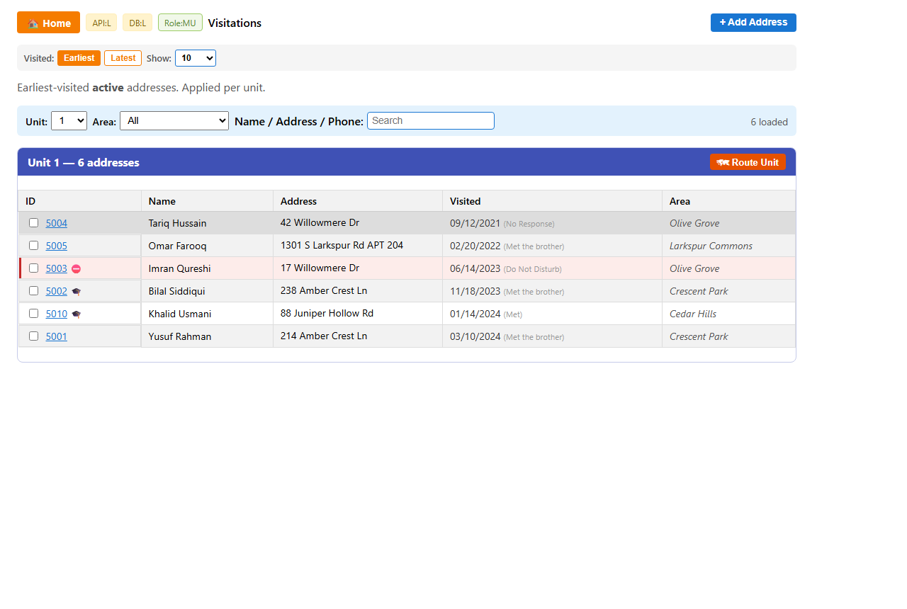
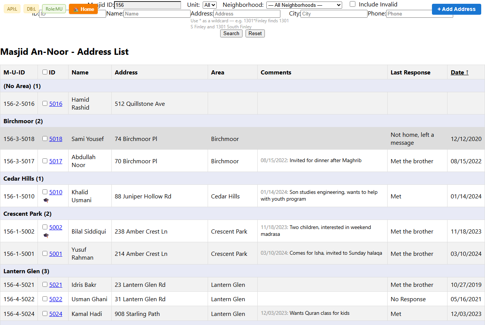
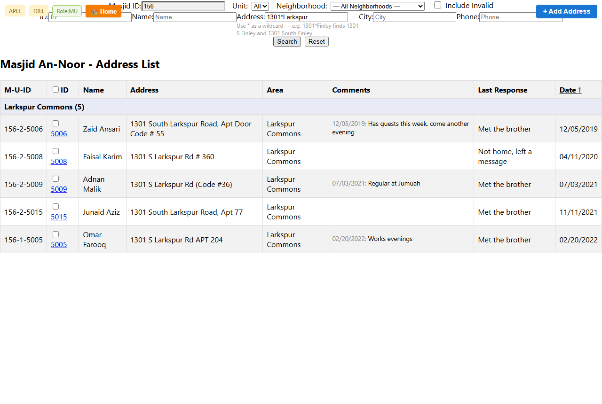
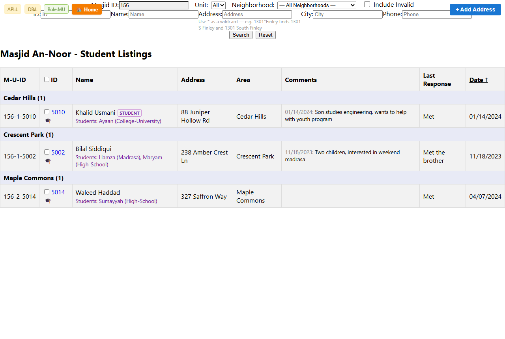
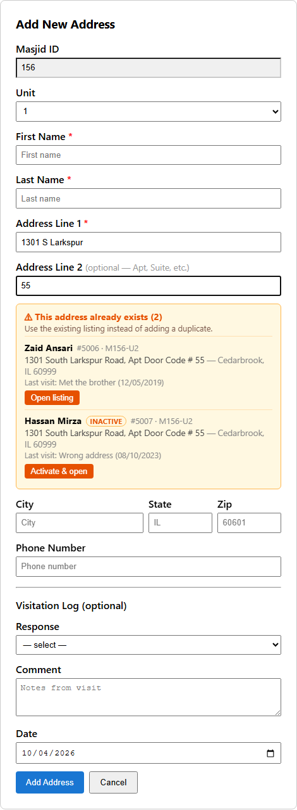
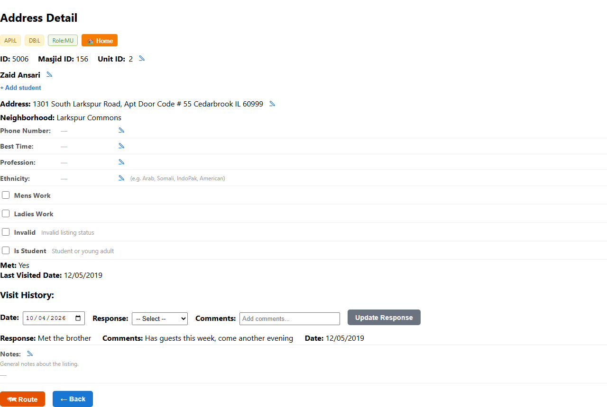
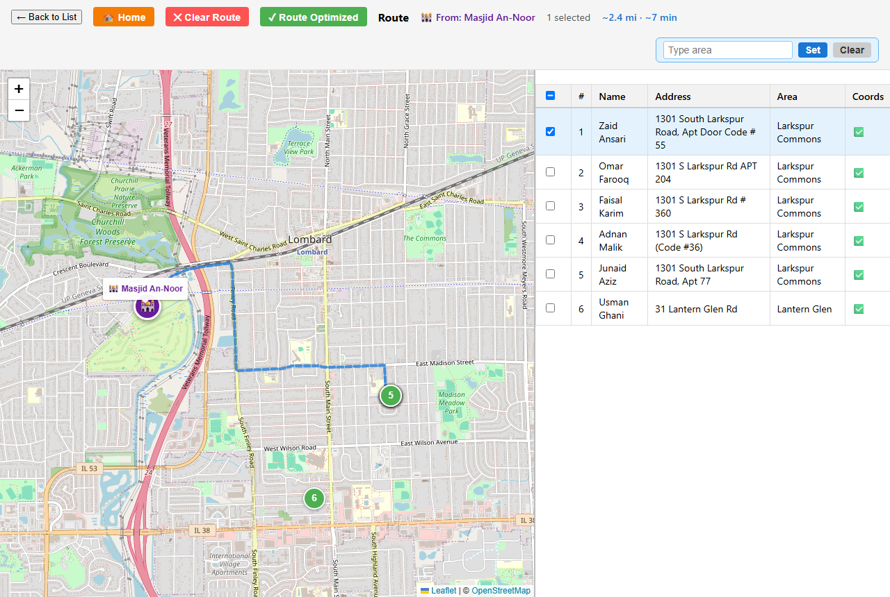
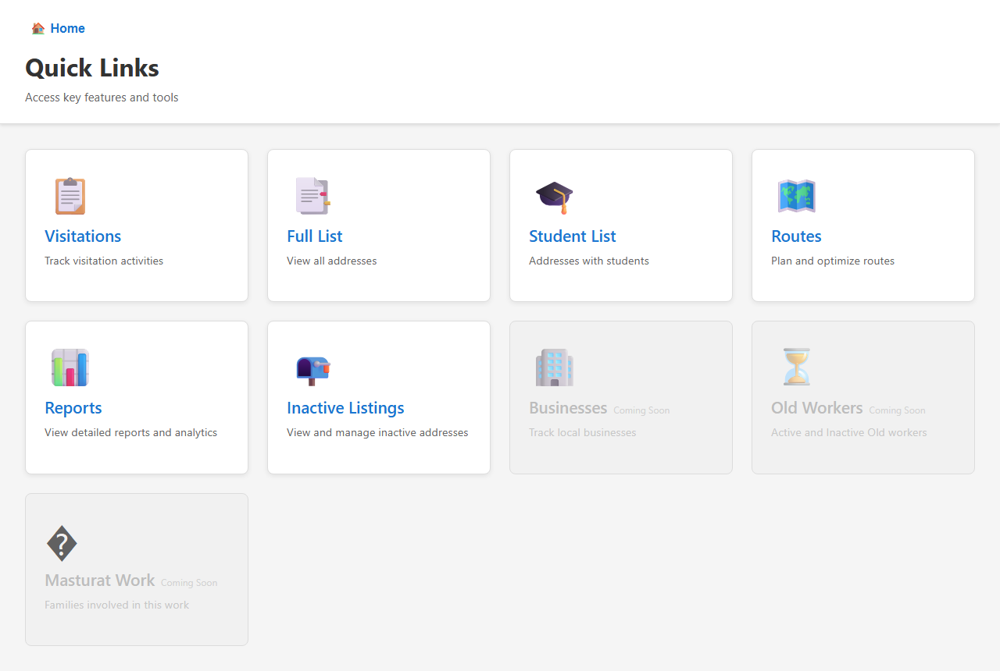

# Chicago Visitations — User Manual (Masjid User)

This manual is for **Masjid Users**: volunteers who sign in with a masjid PIN or a masjid link and do the visitation work for one masjid. Administrators use the same screens; their extra tools are in the [Admin Manual](functional-manual-admin.md).

Menu names in the application are the source of truth. Cards labeled **Coming Soon** are planned features and are not usable yet. The screenshots use made-up demo data — the names, streets and masjid shown are fictitious.

## 1. Signing in

1. Open `/masjid-login`, or the masjid's shared link (for example `/di`).
2. Enter the masjid PIN (a shared link already identifies the masjid, so no PIN is needed).
3. Select a unit, or choose **All**.
4. Choose **Visitations**, **Full Listings**, **Student Listings**, or **Quick Links**.

You only see and open listings for your own masjid; opening another masjid's listing shows **Access Denied**. Use **Logout** on a shared device.

## 2. Masjid landing screen

The starting hub for your masjid:

- **Masjid ID** shows the current masjid and cannot be changed here.
- **Unit ID** selects one unit or **All**.
- **Visitations** opens the daily/weekly visitation queue.
- **Full Listings** opens the address list and search tools.
- **Student Listings** opens the address list limited to student listings.
- **Quick Links** opens shortcuts to lists, routes, and reports.
- **Logout** ends the session.

The browser may remember the last masjid, unit, and view.

## 3. Visitations

The visitation queue shows active addresses for the masjid, a manageable number per unit.

1. Choose **Earliest** (least recently visited first) or **Latest** (most recently visited first).
2. Choose how many addresses to show per unit: 5, 10, 25, or a custom number.
3. Filter by unit, then by neighborhood.
4. Search by name, address, or phone number.
5. Review the last visit date and response.
6. Tick addresses and use **Route Selected**, or use **Route Unit**, to plan a route (see [Routes](#7-routes)).
7. Use **+ Add Address** to add a household you met (see [Adding an address](#5-adding-an-address-and-the-duplicate-check)). The unit defaults to the unit filter.

Invalid (inactive) addresses are not in the queue. ⛔ red rows are **Do Not Disturb** — do not visit them (see [Row markers](#row-markers)). 🎓 marks student listings. An address you add here is pinned to the top of its unit with a **NEW** badge. Filters are remembered for the browser session.

## 4. Full Listings

The full address list for the masjid, at `/landing/:masjidID/:unitID`.

### Finding addresses

1. Choose a unit, if available.
2. Fill in any of: ID, name, address, city, phone number.
3. Use the **Neighborhood** selector to narrow by area.
4. Tick **Include Invalid** to also show invalid (inactive) listings.
5. Select **Search**. **Reset** returns to the normal list.

Searches ignore upper/lower case and match any part of a field. In the **Address** box, `*` means "anything here": `1301*Finley` finds both `1301 S Finley Rd` and `1301 South Finley Road`. Everything else is matched exactly as typed. A hint under the Address box shows this example. If you know regular expressions, text containing `.*` is used as a regex as typed (e.g. `13.*Finley`, `1.*.S.* Finley`).

Results are grouped by neighborhood; addresses without one appear under **(No Area)**. The neighborhood filter narrows the current results.

### Row markers

- 🎓 beside the ID: a student listing, or a listing with students.
- ⛔ and a red tint: **Do Not Disturb**. A listing is Do Not Disturb when one of its last three visits has the response "Do Not Disturb" or a comment mentioning "do not disturb" / "DND". **Do not visit these addresses.**
- Green **NEW** badge: an address added during your current visit to the page; it appears at the top straight away.
- **INACTIVE**: an invalid listing (shown only with **Include Invalid** or on Inactive Listings).

Open a listing by selecting its ID.

### Working with several addresses

Tick the checkboxes on the rows you want, then:

- **Set Neighborhood** — give them all the same neighborhood.
- **Set Unit** — move them to another unit.
- **Route** — open them in route planning.

### Student Listings

Student Listings shows only listings marked **Is Student** or with students recorded. Each row shows a **STUDENT** badge and the students' names with where they go (Madrasa, High-School, College-University, Work). The filter stays on through search, reset, unit changes, and **Include Invalid**. Open it from the landing screen or the **Student List** Quick Link.

## 5. Adding an address and the duplicate check

**+ Add Address** is on Full Listings and Visitations.

1. Check the **Unit** (it defaults to the unit you are viewing).
2. Enter **First Name**, **Last Name**, and **Address Line 1** (required).
3. Put the apartment, suite, or unit in **Address Line 2**.
4. Optionally add city, state, zip, phone number, and the first visit (response, comment, date).
5. Select **Add Address**. The new address appears at the top of the list with a **NEW** badge.

**Duplicate check.** While you type the street, the form looks for listings already at that address in your masjid — including invalid ones:

- Only Address Line 1 and Address Line 2 are compared; city, state, and zip are ignored because they are often missing. `St` / `Street` and `S` / `South` count as the same.
- An orange box lists what it finds. **This address already exists** = same address. **Other units at this address** = other apartments in the same building.
- Typing in Address Line 2 narrows the list. `36` finds `Apt 36`, `Unit 36`, and `Apt Door Code # 36` as existing, and `360` or `36B` as other units; anything without `36` is hidden. A leading "Apt", "Unit", "Suite", "Code", or "#" in what you type is ignored.
- Each match has **Open listing**. An invalid match has **Activate & open**, which makes it active again and opens it. Prefer these over adding a duplicate. If you already typed a name, phone, or comment, you are asked before leaving the form.
- The check never stops you: **Add Address** still saves when it really is a different household.

The same check runs when you change the street or apartment on an address's detail page; the listing being edited is never listed as its own duplicate.

## 6. Address detail and visits

Select an address ID to open its details:

- **Do Not Disturb — please do not visit** banner when it applies, and an **Inactive** banner for invalid listings
- ID, Masjid ID, and Unit ID on one row
- Name, students (listed under the name), contact details, and notes
- Street address (with Address Line 2) and neighborhood
- Invalid, Is Student, Met status, and last visited date
- Visit history, newest first

### Recording a visit

Choose the **Date**, select a **Response**, optionally add **Comments**, and select **Update Response** (a response is required). A response of **Invalid**, **Moved**, or **Duplicate** also marks the listing invalid.

### Editing details

Fields with a ✏️ pencil can be edited in place; ✔ saves, ✕ cancels:

- **Name** and **Unit ID**
- **Address** — street, apt/unit, city, state (two letters), and zip (five digits). Changing the street shows a notice that the map and route still use the old location. The [duplicate check](#5-adding-an-address-and-the-duplicate-check) runs while you edit.
- **Phone Number**, **Best Time**, **Profession**, **Ethnicity**
- **Notes**
- **Students** — add, edit, or remove students with name, where they go, and year of birth
- Checkboxes: **Mens Work** / **Ladies Work** (with time spent), **Invalid**, **Is Student** ("Student or young adult")

**Route** opens this address in route planning; it is greyed out when the address has no coordinates. **Back** returns to the list you came from.

## 7. Routes

Route planning opens from ticked rows (**Route**), a whole visitation unit (**Route Unit**), an address's **Route** button, or the **Routes** Quick Link.

1. Review the stops on the map and in the list (only addresses with coordinates can be shown). Markers are blue when ticked, green when the address has a neighborhood, grey when it has none.
2. Started from a single address? Enter a number in **Find nearby** and select **Go** to add that many of the closest active addresses in your masjid (up to 50) — handy for planning a walk around one visit.
3. Tick stops to route only those; with none ticked, all stops are routed.
4. Select **Optimize Route** to calculate a driving route starting from the masjid, then review the total distance and estimated time.
5. **Clear Route** removes the calculated route but keeps the stops.

With stops ticked you can also type a neighborhood in **Type area** and select **Set** to give them all that neighborhood (**Clear** unticks them). From Quick Links, Route View opens with the masjid as the starting point and no stops selected.

## 8. Quick Links and Reports

| Quick Link | What it does |
| --- | --- |
| Visitations | Opens the visitation queue |
| Full List | Opens the full address list for all units |
| Student List | Opens Student Listings |
| Routes | Opens route planning |
| Reports | Opens the Reports screen |
| Inactive Listings | Opens the list of invalid (inactive) listings |
| Businesses, Old Workers, Masturat Work | Coming Soon |

All cards on the **Reports** screen are currently **Coming Soon** (Unvisited Addresses, High Priority, Visit Statistics, Area Summary, Export Data). Use **Home** to return to the masjid landing screen.

## 9. Navigation

- **Home** returns to the masjid landing screen.
- **Back** returns to the previous list or page.
- Opening a page directly without signing in sends you to the login screen.
- **Logout** clears saved filters and the selected masjid on this device.

## 10. Troubleshooting

**No data appears.** Check that the right masjid and unit are selected and that you are online. After the app has been idle, the first load can take up to a minute.

**The duplicate check does not appear on Add Address.** It starts about half a second after you stop typing and needs a house number plus at least two letters of the street (for example `1301 Fi`). It shows **Checking for existing listings…** while waiting. After a new release, reload the page (Ctrl+Shift+R, or close and reopen the installed app).

**An address search finds nothing.** Text is matched exactly as typed. Use `*` for the parts that vary, e.g. `1301*Finley` instead of `1301 S Finley`.

**A route has no stops.** Only addresses with coordinates can be routed. Check the address detail page.

**A button is missing.** Some features are **Coming Soon**; Map View and Excel export are for administrators.

**The app opens at the login screen.** This is normal for a new session — enter the masjid PIN again or use the masjid link.
