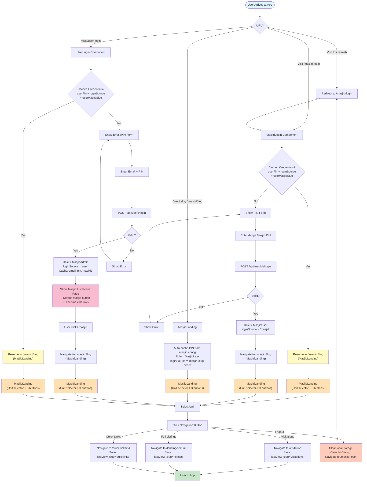

# Login Flow Documentation

All authentication paths in Markaz Visitation UI with entry points, API calls, role assignment, and navigation routing.

---

## Login Flows Overview

### 1. MasjidUser — Masjid PIN Login
**Entry Point:** `/masjid-login`

**Flow:**
1. User enters 4-digit Masjid PIN
2. System calls `POST /api/masjids/login` — plain string match against `masjids.pin`
3. On success:
   - Role set to `'MasjidUser'`
   - `loginSource` set to `'masjid'`
   - `userMasjidSlug` cached to localStorage for session resume
   - Navigate to `/:masjidSlug` (MasjidLanding page)
4. On MasjidLanding:
   - User selects unit from dropdown
   - Clicks one of three buttons: **Visitations**, **Full Listings**, or **Quick Links**
   - Last viewed option stored as `lastView_<masjidSlug>` for future auto-navigation
   - System records selection in `landingContext` and navigates to chosen view

**Return Visits:**
- On subsequent visits via masjid slug URL (e.g., `/muthman`), auto-navigates directly to last viewed page, skipping selection screen

---

### 2. MasjidUser — Direct Slug Auto-Login (NEW)
**Entry Point:** Direct URL access: `/:masjidSlug` (e.g., `/msi`, `/diman`)

**Flow (Automatic - No Form Needed):**
1. User navigates directly to `/:masjidSlug`
2. MasjidLanding component initializes
3. Auto-extracts PIN from masjid config (client-side, no API call)
4. Auto-caches to localStorage:
   - `userPin` ← PIN from masjid config
   - `userMasjidSlug` ← masjid slug
   - `loginSource` ← `'masjid-slug-direct'`
   - `userRole` ← `'MasjidUser'` (via `setUserRole()`)
5. User immediately sees MasjidLanding with:
   - Unit selector dropdown
   - Three navigation buttons (Visitations, Full Listings, Quick Links)
   - Logout button in header
6. User selects unit and clicks desired button
7. Last viewed option saved as `lastView_<slug>`

**Return Visits:**
- On subsequent visits via same slug, auto-navigates directly to last viewed page (skipping selection screen)
- Logout clears cached PIN and `lastView_*` preferences

**Multi-Slug Behavior (Option A):**
- If user is logged into `/msi` and visits `/diman`, PIN auto-switches to `/diman`'s PIN
- Allows seamless multi-masjid access

---

### 3. MasjidAdmin — Email + PIN Login
**Entry Point:** `/user-login`

**Flow:**
1. User navigates to `/user-login`
2. Enters email (required) and PIN (required)
3. System calls `POST /api/users/login` — bcrypt-verifies credentials against `users` collection
4. On success:
   - Role set to `'MasjidAdmin'`
   - `loginSource` set to `'user'`
   - Caches to localStorage: `userEmail`, `userPin`, `userMasjids` (array of masjid slugs), `userMasjidSlug` (primary masjid)
   - **Show result page** with list of accessible masjid slugs
5. On result page:
   - Display welcome message with user's email
   - Show "Continue to Masjid" button (to default masjid)
   - Show links to other accessible masjids
   - User clicks masjid link to navigate to that masjid
6. After navigation to `/:masjidSlug`:
   - Navigate to primary `/:masjidSlug` (MasjidLanding page)
7. On MasjidLanding:
   - Email logout button appears in header
   - "Other Masjids" section shows all masjids user has access to (as collapsible list)
   - User can select unit and click button to navigate to desired view

**Return Visits:**
- On next visit to `/user-login`, if `userPin`, `loginSource='user'`, and `userMasjidSlug` all exist in localStorage → navigate directly to cached slug (no API call, no form shown)

---

### 4. MarkazAdmin — Markaz Admin Password
**Entry Point:** `/admin-login`

**Flow:**
1. User navigates to `/admin-login`
2. Enters admin password (from `REACT_APP_ADMIN_PASSWORD` environment variable)
3. Password validated client-side against env var
4. On success:
   - Role set to `'MarkazAdmin'`
   - Navigate to `/admin-home`
5. On Admin Home:
   - Full admin dashboard access
   - Logout button in header
   - Can navigate to masjid management and user management pages

**Session Duration:**
- MarkazAdmin role expires on page refresh (credentials not cached)

---

### 5. Session Resume (PWA/Return Visit)
**Trigger:** User returns to `/masjid-login` or `/user-login` with cached credentials

**Flow:**
1. Both `MasjidLogin` and `UserLogin` components check localStorage for `userPin`, `loginSource`, and `userMasjidSlug` on mount
2. If all three exist:
   - **Skip login form entirely**
   - Navigate directly to cached `/:masjidSlug`
   - User sees MasjidLanding with unit selector
3. If any missing:
   - Display normal login form

**Purpose:** Enables PWA fast re-entry and seamless app resumption (works for both login types)

---

## Mermaid Flow Diagram

---

## Direct Slug Login vs. Traditional PIN Login

| Aspect | Direct Slug Auto-Login | Traditional PIN Login |
|--------|------------------------|----------------------|
| **Entry Point** | `/:masjidSlug` URL | `/user-login` form |
| **PIN Source** | Extracted from masjid config (client-side) | User enters via form → API call |
| **userPin Cache** | Automatically cached | Cached after API success |
| **loginSource** | `'masjid-slug-direct'` | `'masjid'` |
| **Initial Flow** | Immediate MasjidLanding | `/user-login` → `/:masjidSlug` |
| **Use Case** | Direct slug bookmarks, admin convenience | General user PIN login |
| **Multi-Slug** | Auto-switches PIN (Option A) | Requires new PIN entry |

---

## Key Storage & Session Management

| Key | Value | Set By | Purpose | Cleared On |
|-----|-------|--------|---------|------------|
| `userRole` | `'MasjidUser'` \| `'MasjidAdmin'` \| `'MarkazAdmin'` | Login flow | Role-based access control | Logout |
| `loginSource` | `'masjid'` \| `'user'` \| `'masjid-slug'` \| `'masjid-slug-direct'` \| `'markaz-admin'` | Login flow | Determines logout routing; distinguishes auto-login from manual login | Logout |
| `userEmail` | User email string | MasjidAdmin login | Session resume for admins | Logout |
| `userPin` | User PIN string | MasjidAdmin login OR Direct slug auto-cache | Session resume for admins; auto-cache for slug access | Logout |
| `userMasjids` | JSON array of masjid slugs | MasjidAdmin login | "Other Masjids" dropdown | Logout |
| `userMasjidSlug` | Primary masjid slug | Any login | Session resume navigation | Logout |
| `lastView_<slug>` | `'visitations'` \| `'listings'` \| `'quicklinks'` | Navigation button click | Auto-navigate on return | Logout |
| `landingContext` | `{ masjidID, unitID }` | Navigation button | Unit selection persistence | Logout |
| `preferredMasjid` | Masjid slug | Navigation button | PWA app launch preference | Logout |

---

## Error Handling

**Invalid PIN (MasjidUser):**
- API returns error
- User sees error message
- Remains on `/user-login`
- Can retry

**Invalid Email/PIN (MasjidAdmin):**
- API returns error
- User sees error message
- Remains on `/user-login`
- Can retry

**Invalid Markaz Password (MarkazAdmin):**
- Client-side validation fails
- Error message displayed
- Remains on `/admin-login`
- Can retry

**Invalid/Non-existent Masjid Slug:**
- `MasjidLanding` shows "Masjid Not Found" error
- Button to return to `/user-login`

---

## Security Notes

- **MasjidUser PIN Login**: Plain text match against `masjids.pin` (simple PIN, not secure for sensitive data)
- **MasjidAdmin Login**: Bcrypt-verified passwords stored in database
- **MarkazAdmin Login**: Environment variable `REACT_APP_ADMIN_PASSWORD` (one admin password for all MarkazAdmins)
- **No token/JWT**: Authentication state stored in localStorage; no backend session validation per request
- **sessionStorage**: Filters and preferences cleared on browser tab close

---

## Related Files

- [page-flow.md](page-flow.md) — Full page navigation flow (post-login routing, back navigation, AddressDetail/Route round-trips)
- [MasjidLogin.js](../src/Components/MasjidLogin.js) — Masjid PIN login form with session resume
- [UserLogin.js](../src/Components/UserLogin.js) — User email/PIN login form + result page with masjid list
- [MasjidLanding.js](../src/Components/MasjidLanding.js) — Slug-based landing and navigation selection
- [AdminPasswordLogin.js](../src/Components/AdminPasswordLogin.js) — MarkazAdmin password prompt
- [App.js](../src/App.js) — Routes and entry point redirects
- [config.js](../src/config.js) — `setUserRole()` function and role management
