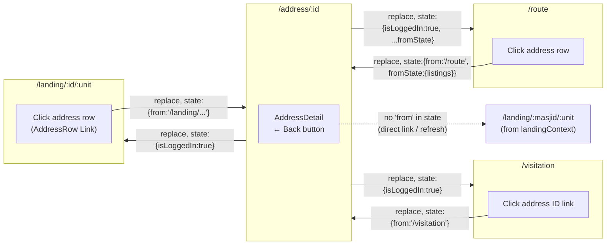
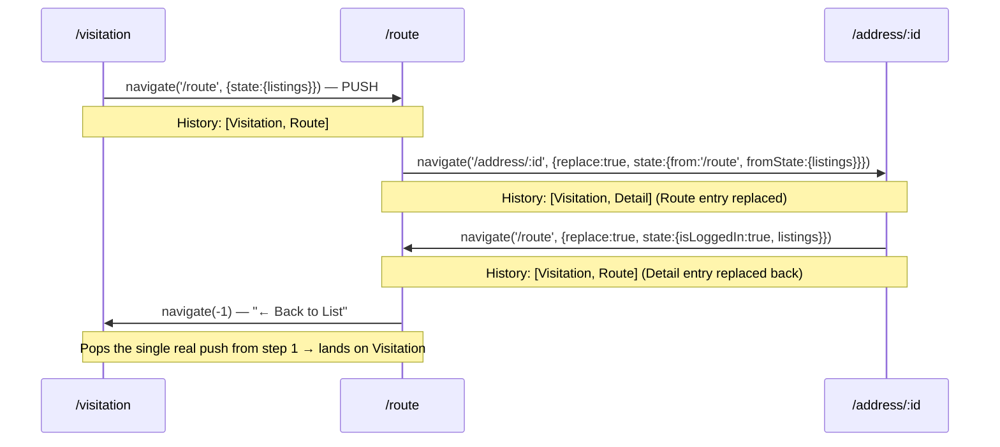

# Page Navigation Flow Documentation

Complete navigation flows for all major pages in Markaz Visitation UI, including entry points, transitions, and back navigation.

---

## 1. Authentication & Login Flow

### 1.1 Homepage Entry
**Route:** `/` (or refresh on any login page)

**Flow:**
```
/ (homepage)
  ↓
Redirect to /masjid-login (primary entry point for most users)
```

### 1.2 Masjid Login Entry
**Route:** `/masjid-login`

**Flow:**
```
/masjid-login
  ↓
Check localStorage for cached credentials (userPin, loginSource, userMasjidSlug)
  ↓
If all three exist:
  → Navigate to /:masjidSlug (skip login form entirely) — seamless session resume
  ↓
Else show Masjid PIN form:
  → User enters 4-digit PIN
  → POST /api/masjids/login
  → Set: userPin, loginSource='masjid', userMasjidSlug
  → Navigate to /:masjidSlug with state: { isLoggedIn: true }
```

### 1.3 User Login Entry
**Route:** `/user-login`

**Flow:**
```
/user-login
  ↓
Check localStorage for cached credentials (userPin, loginSource, userMasjidSlug)
  ↓
If all three exist:
  → Navigate to /:masjidSlug (skip login form entirely) — seamless session resume
  ↓
Else show User Email/PIN form:
  ├─ User enters Email + PIN
  │ → POST /api/users/login
  │ → Set: userPin, userEmail, userMasjids (array), userMasjidSlug, loginSource='user'
  │ → Show result page with list of accessible masjids
  │ → User selects masjid from list OR clicks "Continue to Masjid" button
  │ → Navigate to /:masjidSlug with state: { isLoggedIn: true }
```

---

## 2. MasjidLanding Page Flow

**Route:** `/:masjidSlug` (e.g., `/msi`, `/muthman`, `/diman`)

### 2.1 Direct Slug Access (Auto-Login)
```
/:masjidSlug (direct URL or bookmarked)
  ↓
MasjidLanding component loads
  ↓
Auto-extract PIN from masjid config
  ↓
Cache: userPin, userMasjidSlug, loginSource='masjid-slug-direct', userRole='MasjidUser'
  ↓
Display unit selector + 3 navigation buttons
  ↓
User selects unit + clicks button
```

### 2.2 After Login (from /user-login)
```
/user-login (after successful login)
  ↓
Navigate to /:masjidSlug with state: { isLoggedIn: true }
  ↓
MasjidLanding sees isLoggedIn flag
  ↓
Skip auto-navigation, display unit selector + buttons
```

### 2.3 Return from Child Page (Visitations/Quick Links)
```
/visitation or /quick-links
  ↓
User clicks Back button
  ↓
Navigate to /:masjidSlug with state: { fromChildPage: true }, replace: true
  ↓
MasjidLanding sees fromChildPage flag
  ↓
Skip auto-navigation, display unit selector
  ↓
lastView_<slug> NOT triggered (stays on selection screen)
```

### 2.4 Return Visit (Auto-Navigate)
```
/:masjidSlug (return visit, no special state)
  ↓
MasjidLanding loads with cached data
  ↓
Checks: isLoggedIn? fromChildPage?
  ↓
If neither: check lastView_<slug>
  ↓
If lastView exists:
  → Auto-navigate to last viewed page
  │   ├─ 'visitations' → /visitation
  │   ├─ 'listings' → /landing/:id/:unit
  │   └─ 'quicklinks' → /quick-links/:id
  ↓
Else: display unit selector
```

### 2.5 Navigation Button Clicks (Save & Navigate)
```
User selects unit + clicks button
  ↓
Save to localStorage:
  ├─ preferredMasjid = masjidSlug
  ├─ landingContext = { masjidID, unitID }
  └─ lastView_<slug> = 'visitations'|'listings'|'quicklinks'
  ↓
Navigate to selected page with state: { isLoggedIn: true, masjidID, unitID }
```

---

## 3. Visitation View Page Flow

**Route:** `/visitation`

### 3.1 Entry
```
/visitation (via Visitations button from MasjidLanding)
  ↓
Incoming state: { isLoggedIn: true, masjidID, unitID }
  ↓
Load all addresses for masjid
  ↓
Apply unit filter + display least/most-recently-visited
```

### 3.2 Back Navigation (to MasjidLanding)
```
User at /visitation
  ↓
Clicks 🏠 Home button
  ↓
Check localStorage for masjidSlug
  ↓
If masjidSlug exists:
  → Navigate to /:masjidSlug with:
      ├─ replace: true (replaces history entry)
      └─ state: { fromChildPage: true }
  ↓
Else: navigate(-1) [browser back]
  ↓
Lands on /:masjidSlug with fromChildPage flag
  ↓
MasjidLanding skips auto-navigation, shows unit selector
```

### 3.3 Address Detail round-trip (from an address row)
```
User at /visitation, clicks an address ID link
  ↓
Link carries state: { from: '/visitation' } + replace: true
  (replace → visiting AddressDetail does NOT grow history depth)
  ↓
/address/:id
  ↓
User clicks ← Back
  ↓
handleNavigation() reads location.state.from ('/visitation')
  ↓
navigate('/visitation', { replace: true, state: { isLoggedIn: true } })
  ↓
Back on /visitation — same Unit/Area filters (sessionStorage-backed, untouched)
```

### 3.4 Route (unit-level) round-trip
```
User at /visitation, clicks "🗺 Route Unit" (or "Route Selected")
  ↓
navigate('/route', { state: { listings } })  [push — real history entry]
  ↓
/route — user clicks an address row
  ↓
navigate('/address/:id', { replace: true, state: { from: '/route', fromState: { listings } } })
  ↓
/address/:id — user clicks ← Back
  ↓
navigate('/route', { replace: true, state: { isLoggedIn: true, listings } })
  (fromState is spread back in — Route's map/table are NOT empty)
  ↓
User clicks ← Back to List on /route
  ↓
navigate(-1)  [browser back — pops the one real Route push from 3.4 step 1]
  ↓
Back on /visitation
```

### 3.5 Other Navigation
```
Quick Links button → /quick-links/:id
Unit/Area filters → Re-compute and display (persisted to sessionStorage)
```

---

## 4. Full Listings Page Flow

**Route:** `/landing/:masjidID/:unitID`

### 4.1 Entry
```
/landing/:id/:unit (via Full Listings button from MasjidLanding)
  ↓
Incoming state: { isLoggedIn: true }
  ↓
Fetch addresses for masjid + apply unit filter
  ↓
Display address table with search, filter, bulk actions
```

### 4.2 Back Navigation
```
User at /landing/:id/:unit
  ↓
Clicks 🏠 Home button (top-left, replaces ⚡ Quick Links)
  ↓
Navigate to /:masjidSlug, replace: true, state: { fromChildPage: true }
  ↓
MasjidLanding shows unit selector (no auto-navigate)
```

### 4.3 Address Detail round-trip (from an address row)
```
User at /landing/:id/:unit, clicks an address ID link (AddressRow)
  ↓
Link carries state: { address, from: '/landing/:id/:unit' } + replace: true
  ↓
/address/:id — user clicks ← Back
  ↓
handleNavigation() navigates('/landing/:id/:unit', { replace: true, state: { isLoggedIn: true } })
  (isLoggedIn is required or Landing's guard bounces to /user-login)
  ↓
Back on /landing/:id/:unit — same unit (URL param) + neighborhood filter (component state)
```

### 4.4 Route (selected addresses) round-trip
```
User checks rows ("Select for area assignment" checkbox) → clicks 🗺 Route (n)
  ↓
navigate('/route', { state: { listings, masjidID, unitID } })  [push]
  ↓
/route — same round-trip as §3.4: AddressDetail replace-navigates back to /route
  with fromState restored, then "← Back to List" (navigate(-1)) returns to /landing/:id/:unit
```

### 4.5 Other Navigation
```
Map button → /map/:id/:unit
```

### 4.6 Inactive Listings (dedicated route)
**Route:** `/landing/inactive/:masjidID/:unitID` — same `Landing` component, rendered with the
`showInactive` prop (`<Route path="/landing/inactive/:masjidID/:unitID" element={<Landing showInactive />} />`
in `App.js`, registered alongside the plain `/landing/:masjidID/:unitID` route).

```
Reports page → "Inactive Listings" tile
  ↓
navigate(`/landing/inactive/${masjidID}/${unitID ?? 'all'}`, { state: { isLoggedIn: true } })
  (unitID read from landingContext, matching Report.js's existing masjidID lookup)
  ↓
Landing renders with showInactive=true → isInactiveView derived from the prop, not
location.state — this is what makes it survive the interactions below
  ↓
fetchBaseList() branches on isInactiveView:
  → POST /api/addressList/filter/search/ { masjidId, unitId?, showInactive: true }
  (instead of the plain GET /list used by the non-inactive route)
```

**Why a dedicated route instead of router state:** an earlier version signaled this via
`location.state.showInactive` on the initial navigation only. It broke the moment the user did
anything that re-navigated within Landing — most visibly, switching units via the unit `<select>`
calls `handleUnitChange()`, which builds its own `navigate()` call from scratch and had no way to
know the previous state carried `showInactive: true`, so it silently fell back to the unfiltered
list. Baking the mode into the URL (via the `showInactive` prop on the route element) instead of
transient state means every internal navigation that already knows "am I on the inactive route"
(via `landingBase = isInactiveView ? '/landing/inactive/:masjidID' : '/landing/:masjidID'`) can
carry it forward, and it also survives a page refresh, which router state never did anyway.

**What stays scoped automatically, and why:**
- **Unit switch** (§ handleUnitChange) — navigates via `landingBase`, so switching units while on
  `/landing/inactive/...` re-navigates to `/landing/inactive/:masjidID/:newUnit`, not
  `/landing/:masjidID/:newUnit`.
- **Reset** (`handleReset`) and the **search form** (`doSearch`) — both call the same
  `fetchBaseList()` (reset) or inject `showInactive: true` into the search body (`doSearch`), so
  neither silently drops back to the full list.
- **AddressDetail round-trip** (§6.2) — needs **no changes**. `AddressRow`'s link captures
  `location.pathname` verbatim (`from: `${location.pathname}${location.search}`\``), so it
  automatically carries `/landing/inactive/:id/:unit` when that's where the row was rendered, and
  `AddressDetail`'s `handleNavigation()` just replays `from` as-is.

**Known gap — not fixed by this route, existing limitation kept as-is:**
- `AddressDetail`'s `from`-missing fallback (§6.2, direct link/refresh with no router state) falls
  back to a plain `/landing/:masjid/:unit` built from `landingContext`, which has no "was this
  inactive" flag — same pre-existing limitation as every other Landing filter (area, search) not
  surviving that particular fallback path.
- `MapView`'s "Full Listings" back-button (`MapView.js`) always targets the plain
  `/landing/:masjidID/:unitID`, regardless of how Map View was reached. Admin-only path, not
  touched by this change — flag if this becomes a real complaint.

---

## 5. Quick Links Page Flow

**Route:** `/quick-links/:masjidID`

### 5.1 Entry
```
/quick-links/:id (via Quick Links button from MasjidLanding)
  ↓
Incoming state: { isLoggedIn: true, masjidID }
  ↓
Display grid of quick action links
```

### 5.2 Back Navigation
```
User at /quick-links/:id
  ↓
Clicks Back button (blue link at top)
  ↓
Check localStorage for masjidSlug
  ↓
If masjidSlug exists:
  → Navigate to /:masjidSlug with:
      ├─ replace: true
      └─ state: { fromChildPage: true }
  ↓
Else: navigate(-1) [browser back]
  ↓
Lands on /:masjidSlug with fromChildPage flag
  ↓
MasjidLanding skips auto-navigation, shows unit selector
```

### 5.3 Available Actions
```
Quick Links Grid:
  ├─ Visitations → /visitation
  ├─ Listings → /landing/:id/:unit
  ├─ Map → /map/:id/:unit
  ├─ Route → /route (empty)
  ├─ Export → Download CSV
  └─ [Others based on config]
```

---

## 6. Address Detail Page Flow

**Route:** `/address/:addressID`

### 6.1 Entry
```
/address/:id
  ↓
Can be reached from:
  ├─ Landing (address table row click)
  ├─ VisitationView (address table row click)
  ├─ MapView (marker click)
  └─ RouteView (selected address)
  ↓
Load address details + visit history
```

### 6.2 Back Navigation
```
/address/:id
  ↓
User clicks ← Back
  ↓
handleNavigation() reads location.state.from (set by whichever link/row opened this page)
  ↓
  ├─ from === '/landing/:id/:unit'  → navigate(from, { replace:true, state:{ isLoggedIn:true } })
  ├─ from === '/visitation'         → navigate(from, { replace:true, state:{ isLoggedIn:true } })
  ├─ from === '/route'              → navigate(from, { replace:true, state:{ isLoggedIn:true, ...fromState } })
  └─ from missing (direct link/refresh) → fall back to landingContext-derived /landing/:masjid/:unit
  ↓
Replace (not push) keeps history depth constant — visiting AddressDetail never
leaves an extra entry behind, so the source page's own ← Back / Back-to-List /
browser-back buttons keep working correctly on the next hop.
```

**Why `replace: true` matters:** every link that opens `/address/:id` (from
`AddressRow`, `VisitationView`, `RouteView`) also navigates with `replace: true`.
If either hop used a normal push, AddressDetail visits would grow the history
stack and throw off `navigate(-1)`-based back buttons elsewhere (this was a
real regression — see §14).

### 6.3 Actions
```
Save changes → PUT /api/addressList/:id
Record visit → PUT /api/addressList/visit/:id
Delete → DELETE /api/addressList/:id
Back → Browser history
```

---

## 7. Map View Page Flow

**Route:** `/map/:masjidID/:unitID`

### 7.1 Entry
```
/map/:id/:unit
  ↓
Incoming state: { isLoggedIn: true }
  ↓
Load all addresses, display on Leaflet map
  ↓
Apply unit filter
```

### 7.2 Interactions
```
Click address marker → Show popup + link to /address/:id
Zoom/Pan map
Select multiple addresses for routing
```

### 7.3 Back Navigation
```
Clicks Back or browser back button
  ↓
Navigate(-1) or navigate to previous page
  ↓
Usually returns to Landing or source page
```

---

## 8. Route Planning Page Flow

**Route:** `/route`

### 8.1 Entry
```
/route
  ↓
Incoming state: { listings: [...], masjidID, [unitID] }
  ↓
Display map with selected addresses
  ↓
Allow re-selection and area assignment
```

### 8.2 Back Navigation
```
← Back to List button
  ↓
navigate(-1) [real browser back]
  ↓
Returns to the page that pushed /route onto history
  (VisitationView or Landing — the ONLY push in the whole Route round-trip;
   AddressDetail hops in/out of Route use replace, so they don't count as steps)

🏠 Home button → navigate to /:masjidSlug directly
```

### 8.3 Actions
```
Assign area bulk → PUT /api/addressList/bulk/area
Deselect address → Remove from selection
Select all in unit → Select all visible
Save & Exit → Navigate back
```

---

## 9. Admin Pages Flow

### 9.1 Admin Login
```
/admin-login
  ↓
Enter Markaz admin password
  ↓
Navigate to /admin-home
```

### 9.2 Admin Home
```
/admin-home (MarkazAdmin role required)
  ↓
Navigation hub for admin functions
  ↓
Links to:
  ├─ Masjid Management → /admin/masjids
  ├─ User Management → /admin/users
  ├─ Back to login → /admin-login
  └─ Logout → /admin-login
```

### 9.3 Masjid Management
```
/admin/masjids
  ↓
CRUD operations for masjids
  ↓
Back button → navigate(-1) → /admin-home
```

### 9.4 User Management
```
/admin/users
  ↓
CRUD operations for admin users
  ↓
Back button → navigate(-1) → /admin-home
```

---

## 10. Session & Caching Strategy

| Page | Entry State | Storage Set | Storage Check | Back Behavior |
|------|-------------|-------------|---------------|---------------|
| `/user-login` | None | userPin, userMasjidSlug | Check cached creds | N/A |
| `/:masjidSlug` (new) | None/fromChildPage | userPin, loginSource | Check lastView_* | N/A (home page) |
| `/:masjidSlug` (login) | isLoggedIn | landingContext, lastView_* | Skip auto-nav | N/A |
| `/visitation` | isLoggedIn, unitID | visitationFilters_* | Check sessionStorage | 🏠 Home → /:slug (replace) |
| `/landing/:id/:unit` | isLoggedIn | areaFilter, addressList | Check sessionStorage | 🏠 Home → /:slug (replace) |
| `/landing/inactive/:id/:unit` | isLoggedIn (`showInactive` prop from route, not state) | areaFilter, addressList | Check sessionStorage | 🏠 Home → /:slug (replace) |
| `/quick-links/:id` | isLoggedIn, masjidID | (none) | (none) | → /:slug (replace) |
| `/address/:id` | from, fromState (or none) | (none) | (none) | replace-navigate to `from`, or /landing fallback |
| `/map/:id/:unit` | isLoggedIn | (none) | (none) | Browser back |
| `/route` | listings, masjidID, [unitID] | (none) | (none) | ← Back to List: navigate(-1) |

---

## 11. Key Navigation Patterns

### Pattern 1: Auto-Navigation (MasjidLanding)
- **When:** Return visit to `/:masjidSlug` without special state
- **How:** Check `lastView_<slug>` localStorage key
- **Purpose:** Resume last viewed page automatically
- **Skip Conditions:** isLoggedIn, fromChildPage flags present

### Pattern 2: Child Page Back (VisitationView, QuickLinks)
- **When:** User clicks Back in child page
- **How:** Navigate to `/:masjidSlug` with `fromChildPage: true` and `replace: true`
- **Purpose:** Show selection screen again, not auto-jump back to child page
- **Fallback:** Browser history if no masjidSlug

### Pattern 3: Browser History Back
- **When:** Landing, Address Detail, Map, Route pages
- **How:** `navigate(-1)` or browser back button
- **Purpose:** Return to source page with full context preserved
- **Works:** Because browser stack has full entry state

### Pattern 4: Direct Slug Access (Auto-Login)
- **When:** User visits `/:masjidSlug` directly
- **How:** Extract PIN from config, cache credentials
- **Purpose:** Skip `/user-login` entirely
- **Works:** PIN known to both frontend and backend

---

## 12. State Flow Diagram

```
START (Browser)
  ↓
[/user-login OR /:masjidSlug]
  ↓
  ├─→ Cached credentials? → YES → /:masjidSlug (auto)
  │
  └─→ NO → /user-login form OR direct slug login
           ↓
           Login successful
           ↓
           /:masjidSlug with state: { isLoggedIn: true }
           ↓
┌──────────────────────────────────────────────────┐
│         MasjidLanding (Unit Selector)             │
│                                                   │
│  User selects unit + clicks button               │
│  Saves lastView_<slug>                           │
│  lastView_<slug> = 'visitations' | 'listings'...│
└──────────────────────────────────────────────────┘
           ↓ (3 options)
      ┌────┴──────┬─────────────┐
      ↓           ↓             ↓
  /visitation  /landing    /quick-links
      │           │             │
      │ Back      │ Back        │ Back
      │ (replace) │ (history)   │ (replace)
      │           │             │
      └─────┬─────┴─────┬───────┘
            ↓           ↓
    /:masjidSlug
    (state: fromChildPage)
            ↓
    Skip auto-nav
    Show unit selector again
            ↓
    Return to step: User selects unit...
           OR
    (on next visit without special state)
    Auto-navigate to lastView_<slug>
```

---

## 13. AddressDetail Back-Navigation (Mermaid)

`AddressDetail` doesn't know which page it was opened from at compile time —
every entry point (`AddressRow`, `VisitationView`, `RouteView`) passes it via
router `state`: `{ from, fromState }`. The key rule is that **both directions
of the AddressDetail hop use `replace: true`**, so opening/closing a detail
page never grows the history stack.



### 13.1 Full Route round-trip (the tricky one)

Route is reached via a real `push` (from Visitation or Landing), but every
subsequent hop to/from AddressDetail is a `replace`. That distinction is what
makes `← Back to List`'s `navigate(-1)` land in the right place.



If either AddressDetail hop used a normal push instead of replace, the stack
would grow to `[Visitation, Route, Route']` and `navigate(-1)` would land back
on a stale `AddressDetail`/`Route` entry instead of `Visitation` — this was a
real regression caught by the Playwright tests in `tests/`.

---

## 14. Related Files

- [login_flow.md](login_flow.md) — Detailed authentication flows
- [MasjidLanding.js](../src/Components/MasjidLanding.js) — Auto-nav and unit selection logic
- [VisitationView.js](../src/Components/VisitationView.js) — Back navigation to slug, Route round-trip
- [RouteView.js](../src/Components/RouteView.js) — Route planning, AddressDetail hop with fromState
- [AddressDetail.js](../src/Components/AddressDetail.js) — `handleNavigation` (replace-based back navigation)
- [QuickLinks.js](../src/Components/QuickLinks.js) — Back navigation to slug
- [UserLogin.js](../src/Components/UserLogin.js) — Session resume logic
- [Landing.js](../src/Components/Landing.js) — Address list page
- [tests/visitation-navigation.spec.js](../tests/visitation-navigation.spec.js) — Playwright regression coverage
- [tests/landing-navigation.spec.js](../tests/landing-navigation.spec.js) — Playwright regression coverage
- [AGENTS.md](../AGENTS.md) — Architecture & API endpoints
